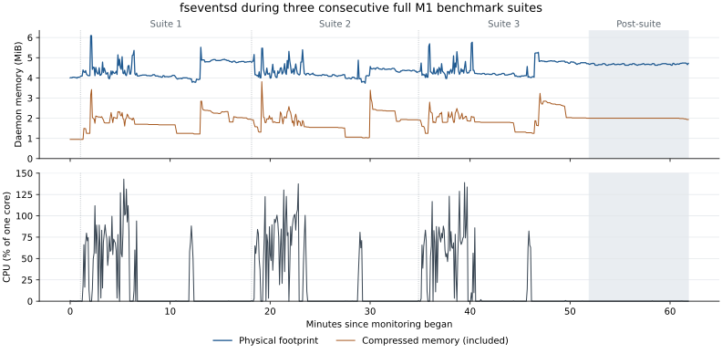

# 0.4.2 release measurements

The primary record is the first full M1 suite, selected before the run. Two further consecutive suites measure repeatability and exercise filesystem-daemon recovery. No M5 performance measurements were taken for this release.

The comparison baseline is the complete 0.4.1 run after the user restarted fseventsd on 2026-09-07, source `5f48cf03` (the released 0.4.1 runtime). The new suites use `cc717e79`; runtime `7d2123d` is unchanged by the final formula checksum commit. Each stage starts a fresh VM with eight vCPUs, 4 GiB RAM and a 128 GiB sparse data disk. The boot case uses the same CLI defaults as the baseline. Each timing case has an untimed warm-up and three ordered repetitions; memory and power rows are single sampling windows.

The baseline and new suites use the same benchmark cases and the same M1. Six consecutive quiet samples ten seconds apart precede the first new suite. There is no daemon reset between suites. These are cross-session numeric changes, not causal speedup estimates. Workload, cache, thermal and background variation remain possible. The three-run CV is descriptive and is not a universal regression threshold.

Raw CSVs, source/artifact stamps, monitoring samples and the exact soak protocol are retained in [the release records](results/releases/0.4.2/).

## Reading the comparison

Host-share installation times are numerically higher in the primary 0.4.2 run. Across all three new runs, changes versus the single fresh 0.4.1 baseline were npm-install: +2.1% to +3.9%; pnpm-install: -0.1% to +9.0%; yarn-install: +5.5% to +13.8%. These shifts are retained rather than dismissed as noise. A single baseline session and three later sessions do not distinguish release effects from session effects; no causal speedup or regression estimate is claimed.

The earlier five-run storage-only variance baseline remains in [REPEATABILITY.md](REPEATABILITY.md). Full-suite variation below can be larger: it includes changing cache state across storage, memory, networking and translated workloads.

## M1 — share

| Metric | Unit | 0.4.1 | 0.4.2 primary | Numeric change | Run 2 | Run 3 | Between-run CV |
|---|---|---:|---:|---:|---:|---:|---:|
| npm-install | ms | 11045 | 11434 | +3.5% | 11282 | 11471 | 0.9% |
| pnpm-install | ms | 6338 | 6911 | +9.0% | 6333 | 6714 | 4.4% |
| yarn-install | ms | 10350 | 11782 | +13.8% | 10916 | 11271 | 3.8% |
| ripgrep | ms | 241 | 178 | -26.1% | 197 | 288 | 26.6% |
| find-walk | ms | 122 | 123 | +0.8% | 126 | 138 | 6.2% |
| copy-tree | ms | 7609 | 7595 | -0.2% | 6557 | 7960 | 9.9% |
| rm-rf | ms | 2657 | 2699 | +1.6% | 2604 | 2593 | 2.2% |
| cpu-sha256 | ms | 6292 | 6307 | +0.2% | 6310 | 6291 | 0.2% |
| container-start | ms | 259 | 201 | -22.4% | 183 | 254 | 17.4% |
| watch-latency | ms | 11 | 2 | -81.8% | 5 | 4 | 41.7% |
| memory-peak | MiB | 3101 | 4070 | +31.2% | 4082 | 3072 | 15.5% |
| memory-after-15s | MiB | 774 | 819 | +5.8% | 843 | 830 | 1.4% |
| memory-after-60s | MiB | 776 | 826 | +6.4% | 843 | 830 | 1.1% |
| net-tcp-egress | Mbit/s | 56939 | 56866 | -0.1% | 55878 | 56215 | 0.9% |
| net-tcp-egress-r | Mbit/s | 50283 | 50171 | -0.2% | 49616 | 50384 | 0.8% |
| net-tcp-port | Mbit/s | 48820 | 48077 | -1.5% | 48233 | 48936 | 0.9% |
| net-tcp-port-r | Mbit/s | 54945 | 55229 | +0.5% | 53993 | 53928 | 1.3% |
| net-udp | Mbit/s | 4825 | 4832 | +0.1% | 4837 | 4778 | 0.7% |
| net-connect-rate | connections/s | 11830 | 8838 | -25.3% | 14322 | 12942 | 23.7% |
| net-http-p99 | µs | 246 | 249 | +1.2% | 248 | 251 | 0.6% |
| net-http-latency | µs | 133 | 131 | -1.5% | 132 | 132 | 0.4% |
| net-dns | µs | 117 | 61 | -47.9% | 129 | 163 | 44.1% |
| power-cpu-ms-per-s | CPU ms/s | 7 | 6 | -14.3% | 7 | 6 | 9.1% |
| power-wakeups-per-s | wakeups/s | 58 | 54 | -6.9% | 59 | 56 | 4.5% |
| power-pkg-idle-wakeups-per-s | wakeups/s | 2 | 1 | -50.0% | 1 | 2 | 43.3% |
| boot-docker | ms | 653 | 653 | +0.0% | 656 | 654 | 0.2% |
| boot-first-container | ms | 826 | 834 | +1.0% | 847 | 819 | 1.7% |
| memory-idle | MiB | 232 | 240 | +3.4% | 251 | 255 | 3.1% |

## M1 — guest

| Metric | Unit | 0.4.1 | 0.4.2 primary | Numeric change | Run 2 | Run 3 | Between-run CV |
|---|---|---:|---:|---:|---:|---:|---:|
| npm-install | ms | 7534 | 7595 | +0.8% | 7529 | 7544 | 0.5% |
| pnpm-install | ms | 1748 | 1768 | +1.1% | 1686 | 1755 | 2.5% |
| yarn-install | ms | 7767 | 7948 | +2.3% | 7862 | 7917 | 0.6% |
| ripgrep | ms | 133 | 129 | -3.0% | 129 | 135 | 2.6% |
| find-walk | ms | 121 | 120 | -0.8% | 121 | 120 | 0.5% |
| copy-tree | ms | 4302 | 5143 | +19.5% | 3089 | 3676 | 26.7% |
| rm-rf | ms | 582 | 600 | +3.1% | 604 | 593 | 0.9% |

## M1 — amd64

| Metric | Unit | 0.4.1 | 0.4.2 primary | Numeric change | Run 2 | Run 3 | Between-run CV |
|---|---|---:|---:|---:|---:|---:|---:|
| npm-install | ms | 15258 | 15350 | +0.6% | 15248 | 15231 | 0.4% |
| pnpm-install | ms | 3843 | 3830 | -0.3% | 3821 | 3824 | 0.1% |
| cpu-sha256 | ms | 7169 | 7172 | +0.0% | 7177 | 7165 | 0.1% |
| container-start | ms | 218 | 196 | -10.1% | 189 | 198 | 2.4% |

## Memory comparison context

The fresh-daemon baseline remains the comparison above. The previously published 0.4.1 record is retained as additional context, because the single memory windows vary materially between otherwise equivalent release workloads.

| Memory metric (MiB) | Published 0.4.1 | Fresh-daemon 0.4.1 | Primary 0.4.2 |
|---|---:|---:|---:|
| memory-peak | 4098 | 3101 | 4070 |
| memory-after-15s | 834 | 774 | 819 |
| memory-after-60s | 828 | 776 | 826 |
| memory-idle | 242 | 232 | 240 |

There are no filesystem or memory-policy source changes in 0.4.2. Its guest agent was rebuilt with the new version number. Differences here do not establish a causal speedup or memory regression; all samples, including outliers, remain in the raw records.

## Filesystem-daemon soak

All samples observed fseventsd PID 81590; it was not restarted. Monitoring spans 2026-09-07T16:13:55.846585+00:00 through 2026-09-07T17:15:45.681858+00:00. There were 726 valid samples and 0 monitor errors.

Daemon physical footprint: baseline median 4.02 MiB; peak 6.09 MiB; final 4.72 MiB. Transient CPU peak 143.0%. During the ten-minute post-suite observation, median CPU was 0.0% and maximum 0.3%.

The largest sampled benchmark-VM physical footprint was 4449.1 MiB. This is the macOS task ledger, including host overhead and compression; the configured 4 GiB limits guest RAM. Five-second monitoring can miss shorter peaks. The dedicated workload-memory cases above sample their own peaks more frequently.

A quiet result does not establish a fix for the original fseventsd incident. Its historical trigger remains unreproduced.
