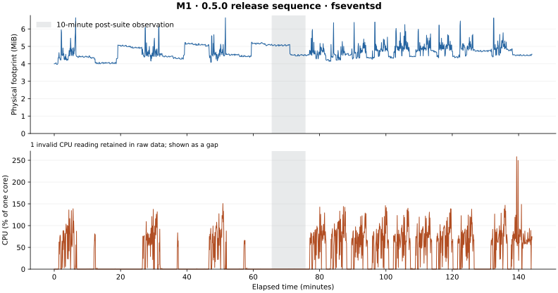
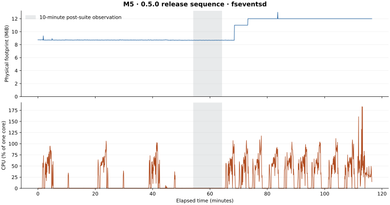

# 0.5.0 release measurements

The primary record for each host is its first valid complete host-share, guest-disk and amd64 suite, selected by execution order. Two further consecutive suites retain full-workload variation. Each timing row is the median of three timed repetitions. The harness attempts an untimed installation for each package manager and an untimed npm install to materialize read/metadata inputs. Warm-up and per-repetition setup exit statuses were not retained by this recording protocol. Ordinary measured-case stdout/stderr is retained and audited for setup diagnostics; the old memory sampler discarded successful-case output. That audit cannot retroactively verify ignored statuses. Each valid timing case requires three successful measured repetitions, whose first can still include remaining cold-cache cost. Those cases do not receive an additional per-case warm-up: the first timed read can be colder and is retained. Cold-start tests have an untimed round. Memory and power rows are single sampling windows.

All runs use source `1b0caabf34fbe359f11cd47cc87ce45dc8583682`, with runtime code frozen at `66897086c3702b75d79cb6fcfed7736842b80780`. The runtime and guest fingerprints are checked throughout. Each fresh Lighter VM has eight vCPUs and a 128 GiB sparse disk, with 4 GiB guest RAM on M1 and 16 GiB on M5. Node 24.18.0, npm 11.16.0, pnpm 10.28.0 and Yarn 1.22.22 are pinned for native and container workloads. Identical prebuilt benchmark images are shared between runtimes and hosts.

Each stage requires six consecutive host CPU observations at most 5% of aggregate machine capacity, ten seconds apart. Competing VMs are checked every second throughout; an unexpected VM invalidates the stage. CPU and filesystem-daemon observations remain available for judging interference during the workload. Neither daemon resets nor discarded slow repetitions improve the selected result.

The five fresh storage runs below measure variation between per-run medians, using sample standard deviation divided by their arithmetic mean. This CV is descriptive for each workload and host; it is not a universal regression threshold. The separate ABBA comparison uses VMMs rebuilt from the published v0.4.1 source and the frozen 0.5.0 source with the same Rust toolchain, in order 0.4.1, 0.5.0, 0.5.0, 0.4.1. The baseline guest comes from the published 0.4.1 archive; the new guest is the frozen 0.5.0 payload. Both use the same pinned workload. Relative time change is the ratio of the two versions’ geometric means minus one. Positive means longer elapsed time. Two runs per version cannot establish a precise causal effect or justify calling every small difference a speedup.

Competitor preparation uses the same workload cases and pinned image archives. Its isolation helper additionally recognizes Lima 2.1 instance PID files and Apple VM helpers by their exact open instance disk, or by macOS responsibility identifying an explicitly allowed runtime executable. Docker Desktop shutdown uses its synchronous CLI stop command; the original broad process-name kill could also match the supervisor arguments. The corrected OrbStack and Docker Desktop process selectors match executable names rather than supervisor arguments. These harness changes and helper hashes accompany the records. Each competitor environment records the helper hash. Docker stores that report an OCI manifest digest instead of a configuration digest use a derived identity map from the same verified archive; no image layers or workload files change.

[Raw records and selection](../docs/records/0.5.0/benchmarks/) · [Competitor methods and excluded cases](RELEASE-0.5.0-COMPETITORS.md) · [Repeatability](REPEATABILITY.md)

## M1 — share

| Metric | Unit | Primary | Run 2 | Run 3 | Between-run CV |
|---|---|---:|---:|---:|---:|
| npm-install | ms | 11235 | 11634 | 11511 | 1.78% |
| pnpm-install | ms | 6679 | 6797 | 6486 | 2.36% |
| yarn-install | ms | 10933 | 10251 | 10269 | 3.71% |
| ripgrep | ms | 192 | 234 | 217 | 9.86% |
| find-walk | ms | 134 | 128 | 128 | 2.66% |
| copy-tree | ms | 7888 | 7212 | 7753 | 4.70% |
| rm-rf | ms | 2669 | 2659 | 2632 | 0.72% |
| cpu-sha256 | ms | 6296 | 6302 | 6299 | 0.05% |
| container-start | ms | 204 | 231 | 185 | 11.18% |
| watch-latency | ms | 3 | 10 | 2 | 87.18% |
| memory-peak | MiB | 4123 | 2997 | 4252 | 18.21% |
| memory-after-15s | MiB | 813 | 711 | 797 | 7.09% |
| memory-after-60s | MiB | 807 | 739 | 799 | 4.75% |
| net-tcp-egress | Mbit/s | 55819 | 55672 | 56573 | 0.86% |
| net-tcp-egress-r | Mbit/s | 49273 | 50346 | 49378 | 1.19% |
| net-tcp-port | Mbit/s | 48211 | 48165 | 48243 | 0.08% |
| net-tcp-port-r | Mbit/s | 54030 | 54818 | 54099 | 0.80% |
| net-udp | Mbit/s | 4829 | 4819 | 4869 | 0.55% |
| net-connect-rate | connections/s | 10607 | 10879 | 13767 | 14.90% |
| net-http-p99 | µs | 249 | 246 | 246 | 0.70% |
| net-http-latency | µs | 132 | 131 | 131 | 0.44% |
| net-dns | µs | 135 | 67 | 134 | 34.80% |
| power-cpu-ms-per-s | CPU ms/s | 6 | 6 | 6 | 0.00% |
| power-wakeups-per-s | wakeups/s | 51 | 53 | 54 | 2.90% |
| power-pkg-idle-wakeups-per-s | wakeups/s | 1 | 2 | 1 | 43.30% |
| boot-docker | ms | 846 | 862 | 859 | 0.99% |
| boot-first-container | ms | 1030 | 1059 | 1045 | 1.39% |
| memory-idle | MiB | 248 | 261 | 261 | 2.92% |

## M1 — guest

| Metric | Unit | Primary | Run 2 | Run 3 | Between-run CV |
|---|---|---:|---:|---:|---:|
| npm-install | ms | 7584 | 7512 | 7673 | 1.06% |
| pnpm-install | ms | 1760 | 1733 | 1752 | 0.79% |
| yarn-install | ms | 7828 | 7793 | 7851 | 0.37% |
| ripgrep | ms | 131 | 138 | 130 | 3.28% |
| find-walk | ms | 121 | 127 | 121 | 2.82% |
| copy-tree | ms | 4054 | 2925 | 4600 | 22.13% |
| rm-rf | ms | 603 | 593 | 581 | 1.86% |

## M1 — amd64

| Metric | Unit | Primary | Run 2 | Run 3 | Between-run CV |
|---|---|---:|---:|---:|---:|
| npm-install | ms | 15004 | 15058 | 14916 | 0.48% |
| pnpm-install | ms | 3897 | 3813 | 3852 | 1.09% |
| cpu-sha256 | ms | 7182 | 7177 | 7177 | 0.04% |
| container-start | ms | 187 | 171 | 189 | 5.41% |

## M1 — fresh storage variation and ABBA

| Workload | Five same-build medians (ms) | CV | 0.4.1 geometric mean (ms) | 0.5.0 geometric mean (ms) | Relative time change |
|---|---|---:|---:|---:|---:|
| npm-install | 10853, 11070, 11069, 11360, 11690 | 2.89% | 11286.07 | 11602.41 | +2.80% |
| pnpm-install | 7112, 6374, 6431, 6775, 7220 | 5.66% | 6800.13 | 6505.26 | -4.34% |
| yarn-install | 10190, 10029, 10323, 9752, 11180 | 5.23% | 10399.99 | 10903.85 | +4.84% |
| ripgrep | 177, 267, 236, 294, 643 | 56.86% | 239.67 | 388.50 | +62.10% |
| find-walk | 128, 121, 126, 123, 123 | 2.23% | 123.98 | 122.00 | -1.60% |
| copy-tree | 7263, 7815, 7913, 7691, 8716 | 6.72% | 7459.87 | 7849.91 | +5.23% |
| rm-rf | 2625, 2722, 2649, 2795, 2724 | 2.50% | 2705.48 | 2668.47 | -1.37% |

## M1 — filesystem-daemon observation

Observed fseventsd PIDs: [81590]. There were 1697 memory observations, 1696 physically valid CPU readings, 1 invalid CPU readings and 0 collection errors. Invalid CPU values remain in the raw data and are shown as gaps in the graph; they do not enter CPU statistics. Five-second sampling can miss shorter peaks, and memory values inherit top’s display rounding. The daemon was not deliberately restarted.

Daemon footprint: initial 4.00 MiB, peak 6.64 MiB, final 4.55 MiB. Peak sampled CPU was 258.2% of one core. During the 599-second post-suite window, median CPU was 0.0% and maximum 0.3%.

The largest sampled Lighter task footprint was 4493.6 MiB. It includes host overhead and compressed-memory charges; configured guest RAM is not an absolute ceiling on the host process. Dedicated mixed-pressure records separately test memory at 8, 12 and 16 GiB.

## M5 — share

| Metric | Unit | Primary | Run 2 | Run 3 | Between-run CV |
|---|---|---:|---:|---:|---:|
| npm-install | ms | 6302 | 6293 | 6363 | 0.60% |
| pnpm-install | ms | 3857 | 4067 | 3905 | 2.79% |
| yarn-install | ms | 5124 | 5119 | 5204 | 0.93% |
| ripgrep | ms | 91 | 92 | 87 | 2.94% |
| find-walk | ms | 95 | 92 | 94 | 1.63% |
| copy-tree | ms | 3587 | 3556 | 3451 | 2.02% |
| rm-rf | ms | 2639 | 2599 | 2538 | 1.96% |
| cpu-sha256 | ms | 3011 | 3002 | 3039 | 0.64% |
| container-start | ms | 152 | 147 | 152 | 1.92% |
| watch-latency | ms | 6 | 2 | 2 | 69.28% |
| memory-peak | MiB | 4386 | 4009 | 3925 | 5.98% |
| memory-after-15s | MiB | 936 | 927 | 884 | 3.04% |
| memory-after-60s | MiB | 936 | 926 | 905 | 1.72% |
| net-tcp-egress | Mbit/s | 92475 | 90190 | 88216 | 2.36% |
| net-tcp-egress-r | Mbit/s | 84924 | 82930 | 82243 | 1.67% |
| net-tcp-port | Mbit/s | 83763 | 82934 | 83043 | 0.54% |
| net-tcp-port-r | Mbit/s | 88759 | 90518 | 90271 | 1.06% |
| net-udp | Mbit/s | 4993 | 5007 | 5003 | 0.14% |
| net-connect-rate | connections/s | 16828 | 17030 | 16622 | 1.21% |
| net-http-p99 | µs | 154 | 182 | 236 | 21.86% |
| net-http-latency | µs | 60 | 74 | 77 | 12.90% |
| net-dns | µs | 37 | 41 | 42 | 6.61% |
| power-cpu-ms-per-s | CPU ms/s | 3 | 3 | 3 | 0.00% |
| power-wakeups-per-s | wakeups/s | 61 | 52 | 56 | 8.00% |
| power-pkg-idle-wakeups-per-s | wakeups/s | 1 | 1 | 1 | 0.00% |
| boot-docker | ms | 1649 | 1537 | 1575 | 3.59% |
| boot-first-container | ms | 1799 | 1681 | 1722 | 3.45% |
| memory-idle | MiB | 365 | 372 | 361 | 1.52% |

## M5 — guest

| Metric | Unit | Primary | Run 2 | Run 3 | Between-run CV |
|---|---|---:|---:|---:|---:|
| npm-install | ms | 4605 | 4535 | 4499 | 1.19% |
| pnpm-install | ms | 1216 | 1152 | 1211 | 2.98% |
| yarn-install | ms | 4152 | 4084 | 4081 | 0.98% |
| ripgrep | ms | 79 | 86 | 82 | 4.27% |
| find-walk | ms | 97 | 96 | 93 | 2.18% |
| copy-tree | ms | 937 | 960 | 969 | 1.73% |
| rm-rf | ms | 387 | 386 | 386 | 0.15% |

## M5 — amd64

| Metric | Unit | Primary | Run 2 | Run 3 | Between-run CV |
|---|---|---:|---:|---:|---:|
| npm-install | ms | 9237 | 9213 | 9146 | 0.51% |
| pnpm-install | ms | 2735 | 2828 | 2726 | 2.04% |
| cpu-sha256 | ms | 4223 | 4236 | 4247 | 0.28% |
| container-start | ms | 155 | 146 | 164 | 5.81% |

## M5 — fresh storage variation and ABBA

| Workload | Five same-build medians (ms) | CV | 0.4.1 geometric mean (ms) | 0.5.0 geometric mean (ms) | Relative time change |
|---|---|---:|---:|---:|---:|
| npm-install | 6357, 6241, 6218, 6285, 6241 | 0.88% | 6364.90 | 6288.50 | -1.20% |
| pnpm-install | 4011, 3953, 3873, 4020, 3918 | 1.57% | 4018.00 | 3978.91 | -0.97% |
| yarn-install | 5156, 5062, 5294, 5122, 5083 | 1.78% | 5138.99 | 5182.36 | +0.84% |
| ripgrep | 89, 85, 82, 89, 87 | 3.43% | 83.99 | 85.95 | +2.33% |
| find-walk | 92, 93, 91, 93, 98 | 2.89% | 97.98 | 96.49 | -1.52% |
| copy-tree | 3717, 3492, 3933, 3745, 3957 | 5.00% | 3605.96 | 3878.43 | +7.56% |
| rm-rf | 2482, 2651, 2535, 2482, 2486 | 2.88% | 2541.49 | 2559.64 | +0.71% |

## M5 — filesystem-daemon observation

Observed fseventsd PIDs: [72096]. There were 1368 memory observations, 1368 physically valid CPU readings, 0 invalid CPU readings and 0 collection errors. Invalid CPU values remain in the raw data and are shown as gaps in the graph; they do not enter CPU statistics. Five-second sampling can miss shorter peaks, and memory values inherit top’s display rounding. The daemon was not deliberately restarted.

Daemon footprint: initial 8.75 MiB, peak 13.00 MiB, final 12.00 MiB. Peak sampled CPU was 183.2% of one core. During the 591-second post-suite window, median CPU was 0.1% and maximum 0.6%.

The largest sampled Lighter task footprint was 10598.4 MiB. It includes host overhead and compressed-memory charges; configured guest RAM is not an absolute ceiling on the host process. Dedicated mixed-pressure records separately test memory at 8, 12 and 16 GiB.

## M1 — reversed-order follow-up

Initial M1 ripgrep +62.1% versus five-fresh-run CV56.86%; copy +5.23% versus CV6.72%. Retain reversed order to check reproducibility, preserving all initial runs. The follow-up uses the full storage workload in order 0.5.0, 0.4.1, 0.4.1, 0.5.0. Both comparisons are retained separately. It was selected after seeing the initial result, so it is not an independent preplanned replication.

| Workload | Ordered medians (ms), 0.5/0.4/0.4/0.5 | Initial ABBA time change | Follow-up time change |
|---|---|---:|---:|
| npm-install | 12193, 12212, 11607, 11487 | +2.80% | -0.60% |
| pnpm-install | 7656, 6719, 6608, 6537 | -4.34% | +6.17% |
| yarn-install | 11896, 11163, 10261, 10640 | +4.84% | +5.12% |
| ripgrep | 311, 259, 459, 201 | +62.10% | -27.49% |
| find-walk | 125, 123, 123, 124 | -1.60% | +1.22% |
| copy-tree | 8160, 8314, 7886, 7303 | +5.23% | -4.66% |
| rm-rf | 2816, 2816, 2797, 2849 | -1.37% | +0.93% |

## M5 — reversed-order follow-up

first M5 ABBA copy-tree elapsed time +7.56% with five-fresh-run CV5.00%; reversed order tests reproducibility; original results remain unchanged. The follow-up uses the full storage workload in order 0.5.0, 0.4.1, 0.4.1, 0.5.0. Both comparisons are retained separately. It was selected after seeing the initial result, so it is not an independent preplanned replication.

| Workload | Ordered medians (ms), 0.5/0.4/0.4/0.5 | Initial ABBA time change | Follow-up time change |
|---|---|---:|---:|
| npm-install | 6585, 6380, 6307, 6377 | -1.20% | +2.16% |
| pnpm-install | 4075, 4106, 4169, 3966 | -0.97% | -2.83% |
| yarn-install | 5329, 5355, 5393, 5298 | +0.84% | -1.13% |
| ripgrep | 84, 87, 89, 89 | +2.33% | -1.74% |
| find-walk | 95, 94, 92, 94 | -1.52% | +1.62% |
| copy-tree | 3861, 3708, 3772, 3942 | +7.56% | +4.32% |
| rm-rf | 2588, 2697, 2730, 2674 | +0.71% | -3.05% |

## Interpretation limits

The M1 ripgrep case has a 56.86% CV across five fresh same-build medians (177, 267, 236, 294 and 643 ms). This protocol has poor precision for that workload on this host. Its apparent old/new differences do not establish a causal change. Other workloads have their own measured CVs; there is no universal five-percent noise threshold. Guest-disk tree-copy repetitions also vary substantially, so historical single-session differences are not treated as controlled regressions.

Several apparent changes reverse direction with order. On M1, ripgrep changes from +62.10% in ABBA to -27.49% in BAAB, and copy from +5.23% to -4.66%. Those initial slowdowns did not reproduce.

M1 Yarn installation takes longer in both orders: +4.84% and +5.12%, against a five-fresh-run CV of 5.23%. This is a possible performance cost worth retaining, not evidence of no regression. The small number of runs and observed variation limit the precision and causal interpretation.

M5 host-share tree copy takes longer in both orders: +7.56% and +4.32%, against a five-fresh-run CV of 5.00%. This is a possible performance cost worth retaining, not evidence of no regression. The small number of runs and observed variation limit the precision and causal interpretation.

M5 pnpm installation is shorter in both comparisons (-0.97% and -2.83%). Other small changes commonly switch direction. These workload-specific observations do not support a blanket speedup claim for 0.5.0.

These measurements do not establish a fix for the historical fseventsd incident if its original trigger did not recur. Raw samples and all attempted-run status remain part of the release record.
